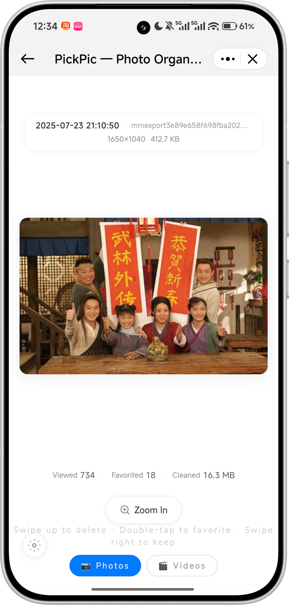
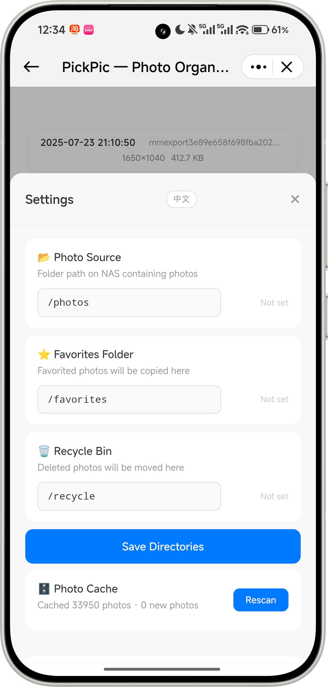
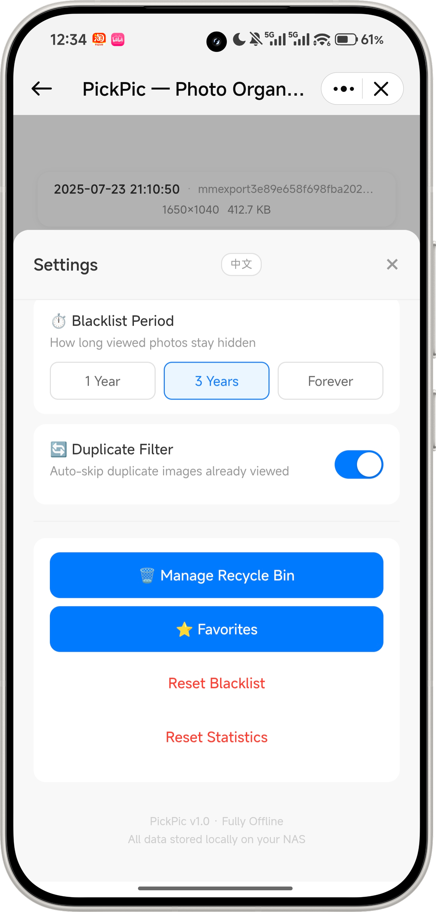
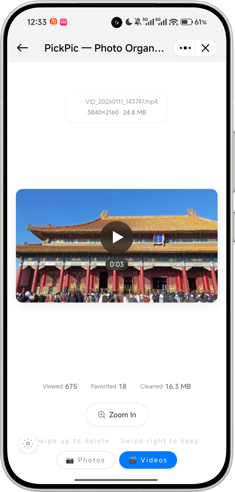

# PickPic — Photo Organizer

**English** | [简体中文](./README.md)

> A web-based photo sorting tool with Tinder-style card interactions for quick keep-or-delete decisions. **Runs entirely offline — no network requests, no data collection.** Features random photo shuffle, gesture controls (swipe right/up/double-tap/left recall), smart blacklist, MD5 dedup, thumbnail caching, video playback, full-screen viewer, recycle bin, favorites, EXIF parsing, and more.

## Preview

**📱 Mobile** &nbsp;&nbsp;|&nbsp;&nbsp; **🖥️ Desktop**
:--: | :--:
[](https://www.bilibili.com/video/BV1qh7b6xEwN) | [](https://www.bilibili.com/video/BV1Rv7b6XEqu)
↑ Click cover to play | ↑ Click cover to play

### Screenshots

| Photo | Settings | Settings | Video |
|:--:|:--:|:--:|:--:|
|  |  |  |  |

## Features

### 📷 Random Shuffle
- Globally shuffles all photos — across folders, dates, and locations
- Photo / video dual-mode with independent browsing queues
- Dual-layer card architecture: current photo + preloaded next, with progressive reveal animation

### ✋ Gesture Controls
- **Swipe right** → keep the photo, move to next
- **Swipe up** → move to recycle bin (with confirmation)
- **Double-tap** → add to favorites with a heart burst animation
- **Single tap** → view photo details (date, location, path, resolution)
- Full mouse drag support for desktop

### ↩️ Left-Swipe Recall
- Bring back the last photo you swiped past
- Smooth ease-out scale animation (0.3 → 1.0)

### 🚫 Smart Blacklist
- Viewed photos are automatically blacklisted — won't appear again for 3 years by default
- Configurable duration: 1 year / 3 years / forever
- Background incremental scanning detects new and deleted files

### 🔄 Duplicate Filter
- Pre-computed MD5 hashes for content-based dedup
- Identical photos shown only once, with toggle on/off

### 🎬 Video Support
- 7 video formats: MP4, MOV, AVI, MKV, WebM, 3GP, FLV
- ffmpeg extracts first frame as thumbnail; ffprobe reads duration & resolution
- Built-in `<video>` player with controls in full-screen viewer

### 🔍 Full-Screen Viewer
- Tap the "Zoom In" button to enter full-screen mode
- Pinch-to-zoom (0.5x ~ 5x), double-tap zoom in/out, drag to pan
- Mouse wheel zoom (desktop)

### 🗑️ Recycle Bin
- Deleted photos go to recycle bin, not permanently removed
- Single restore, batch restore, restore all
- Selective permanent delete, empty all (with confirmation)
- Auto-generates thumbnails for recycled items

### ⭐ Favorites
- Browse all favorited photos in one place
- Unfavorite or move to recycle bin
- Favorited files are copied to a dedicated directory

### 📊 Statistics
- Real-time counters: viewed, favorited, cleaned (space freed in MB)
- Reset blacklist and stats with one click

### ⚙️ Flexible Configuration
- Set photo source, favorites, and recycle directories via the settings panel
- Real-time directory validation (existence, writability, photo count)
- Manual full rescan trigger

### 🖼️ Performance
- 400×400 JPEG thumbnail cache — 10x+ faster loading
- EXIF orientation auto-correction
- 33K+ photos with sub-second random access (SQLite cache)
- Scanning runs in background without blocking browsing

### 🎨 iOS Minimalist Design
- Pure white background `#FFFFFF` with generous whitespace
- Frosted glass: `rgba(255,255,255,0.92)` + `backdrop-filter: blur(12px)`
- Lightweight animations: pop, slide, scale, fade
- Soft pink heart `#FFB6C1` for favorites
- Responsive layout for mobile and desktop

## Project Structure

```
PickPic/
├── frontend/                # Vue3 + Vite + TailwindCSS
│   └── src/
│       ├── App.vue          # Main page (dual-card architecture)
│       ├── components/      # 9 components
│       ├── services/api.js  # API client (15 endpoints)
│       └── utils/           # Shared utility functions
├── backend/                 # Python3 + FastAPI + SQLite
│   └── app/
│       ├── main.py          # FastAPI entry point
│       ├── config.py        # Configuration
│       ├── models/          # Database models
│       ├── api/routes.py    # 19 REST API endpoints
│       └── services/        # Core business logic
├── Dockerfile
├── docker-compose.yml
├── deploy.sh                # One-click deploy script
├── ROADMAP.md               # Development roadmap
└── LICENSE                  # MIT
```

## Quick Start

### Option 1: Docker (Recommended)

```bash
git clone https://github.com/SpringShaw/Photo-Sorter.git
cd Photo-Sorter
cp .env.example .env
# Edit .env: set PHOTOS_DIR, FAVORITES_DIR, RECYCLE_DIR
chmod +x deploy.sh
./deploy.sh
# Open http://localhost:8082
```

### Option 2: Docker Compose

```bash
cp .env.example .env
mkdir -p data/db data/thumbnails
docker compose up -d --build
# Visit http://localhost:8082
```

### Option 3: Bare-Metal Deployment

For Linux / macOS / Windows without Docker.

```bash
# 1. Clone the repo
git clone https://github.com/SpringShaw/PickPic.git
cd PickPic

# 2. Install backend dependencies
cd backend
pip install -r requirements.txt

# 3. Build the frontend
cd ../frontend
npm install
npm run build

# 4. Copy frontend assets to backend static dir
cp -r dist/* ../backend/static/

# 5. Create data directories
cd ../backend
mkdir -p data/db data/thumbnails

# 6. Set environment variables (optional)
export PHOTOS_DIR=/path/to/your/photos
export FAVORITES_DIR=/path/to/your/favorites
export RECYCLE_DIR=/path/to/your/recycle

# 7. Start the server
uvicorn app.main:app --host 0.0.0.0 --port 8082
```

For production, use systemd / supervisor / pm2 to keep the process alive.

### Option 4: Local Development

Separate frontend/backend with hot reload, ideal for debugging.

```bash
# Backend (terminal 1)
cd backend
pip install -r requirements.txt
uvicorn app.main:app --host 0.0.0.0 --port 8082 --reload

# Frontend (terminal 2)
cd frontend
npm install
npm run dev
```

## Configuration

| Variable | Default | Description |
|----------|---------|-------------|
| `PORT` | `8082` | Server port |
| `PHOTOS_DIR` | `./photos` | Photo source directory (host path) |
| `FAVORITES_DIR` | `./favorites` | Favorites directory |
| `RECYCLE_DIR` | `./recycle` | Recycle bin directory |
| `BLACKLIST_DURATION` | `3y` | Blacklist period: `1y` / `3y` / `forever` |
| `ENABLE_DUPLICATE_FILTER` | `true` | Duplicate filter toggle |

## Gesture Cheat Sheet

| Gesture | Action |
|---------|--------|
| Swipe right | Keep photo, next |
| Swipe up | Delete (recycle bin) |
| Swipe left | Recall last skipped |
| Double-tap | Favorite |
| Single tap | View info |

## Tech Stack

| Layer | Technology |
|-------|------------|
| Frontend | Vue 3 + Vite + TailwindCSS |
| Backend | Python 3 + FastAPI + SQLite |
| Container | Docker + python:3.11-slim |
| Image Processing | Pillow + pillow-heif (HEIC) |
| Video Processing | ffmpeg (thumbnails + metadata) |

## Supported Formats

| Type | Formats |
|------|---------|
| Images | JPG, JPEG, PNG, WebP, HEIC, HEIF, BMP, GIF, TIFF |
| Videos | MP4, MOV, AVI, MKV, WebM, 3GP, FLV |

## Changelog

See [ROADMAP.md](./ROADMAP.md) for completed features and development plans.

## Highlights

- 🔒 Fully offline — no network, your data stays private
- 🐳 One-click Docker deployment, up in 5 minutes
- 📱 Mobile + desktop gesture support
- ⚡ 33K+ photos with instant random access
- 🎨 iOS-inspired minimalist design
- 🆓 MIT open-source license

## License

[MIT License](LICENSE)

## Credits

